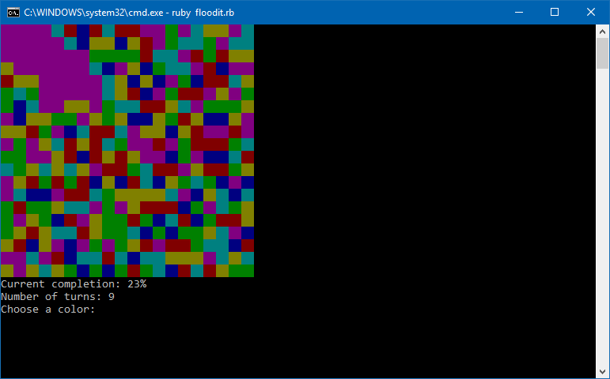

# Flood-It-Ruby-Game

Ruby I/O console game

This program implements a version of the “Flood-It” game. This is a colour based game where the aim is turn all the blocks of a two-dimensional board into one colour. The game starts with the player choosing a colour. The top left block changes to that colour, and all surrounding blocks sharing the same colour merge to form a group. The player then iteratively selects a colour, and the group changes to that colour and merges with all neighbouring blocks of the same colour. The game is over when all blocks have the same colour. The fewer turns the player needs to do this, the better.

You can try out a variant of the game online: (http://unixpapa.com/floodit/)

When the program is started, it shows a splash screen announcing various details about the game. After the splash screen the main menu is entered with the three options start, change size, and quit. The current best game score achieved so far is also presented. The following commands apply:

* Entering “s” starts a new game with a random board.
* Entering “c” lets the player change the size of the board. The default size of the board is 14 columns and 9 rows. When this option is selected, the player first enters the number of columns, and then the number of rows. After that, the player returns back to the main menu. When a new game is started, the board should now have these updated values.
* Entering “q” quits the game (simply terminate the program).
* The main menu includes the best score of the games played so far, i.e., the lowest number of turns taken to complete a game. This is displayed with a message “Best game: X turns”, where “X” shows the actual best score. If no games have been played yet, the message “No games played yet” is displayed instead.

## Game Play

Each game (started with option “s” in the main menu) is played on a new randomly generated board. The board is a two-dimensional array with the dimensions specified in the main menu, or the default values of 14 columns and 9 rows. Each block of the board (i.e., element of the array) is assigned a random colour out of the colours red, green, blue, yellow, magenta, cyan. The game displays the board with each block filled with its colour. A block consists of two space characters with a background colour. A Ruby Gem is used to colourise the text.

Beneath the board, the following messages are included:

* “Turns: X”: This shows the number of turns completed by the player.
* “Current completion: X%”: This shows the percentage of the board that is coloured with the same colour as the currently selected colour as an integer number.
* “Choose a colour: ”: This prompts the player to enter a letter for the next colour Each turn of the game consists of the player choosing a colour by typing the starting letter of the colour followed by the “enter” key: r → red, g → green, b → blue, y → yellow, m → magenta, c → cyan. In addition, typing “q” takes the player back to the main menu.

The gameplay works as follows:

* The selected group initially consists of the top left block, and all neighbouring blocks (i.e., left, right, top, bottom) with the same colour as this block.
* Every time the player enters a colour, all blocks of the current group are changed to that colour.
* In addition, all blocks neighbouring the group that also have this colour are now part of the group. When all blocks of the board have the same colour, the message “You won after X turns” is printed, where “X” represents the number of turns. The player has to confirm by hitting “enter”, then the game returns to the main menu. If the number of turns achieved in a game is lower than in previous games, then the best score in the main menu now shows the updated value.

## Execution

1. With a ruby enabled terminator emulator run the command `bundle install` to install all of the gem dependencies
2. With a ruby enabled terminator emulator run the command `ruby floodit.rb` to begin the game.
3. Follow the on-screen instructions and aforementioned gameplay instructions to play.
